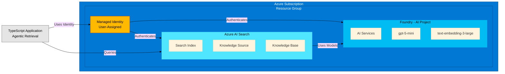

# Architecture Diagram

## Components

- **Azure AI Search**: Vector search with semantic capabilities, knowledge base management
- **Azure AI Foundry**: AI project hosting GPT and embedding models  
- **Managed Identity**: Secure authentication between services
- **TypeScript App**: Agentic retrieval application using knowledge bases
